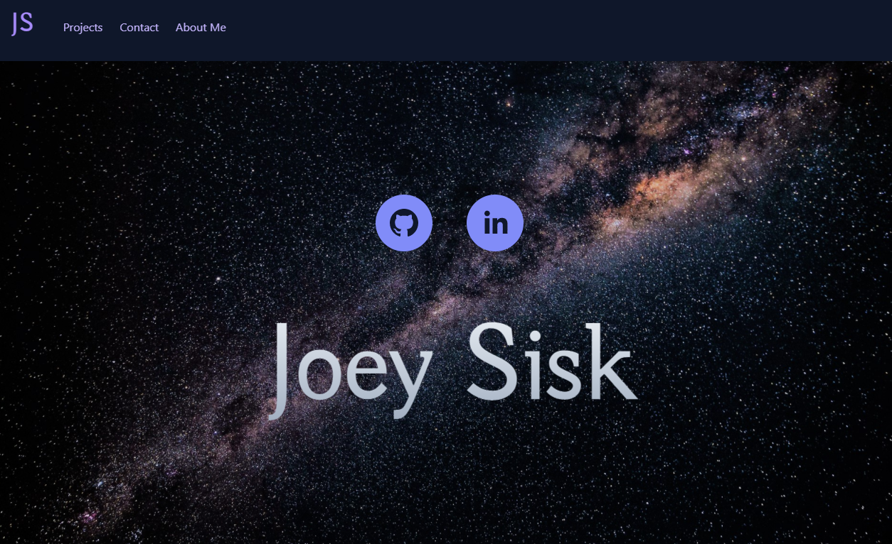
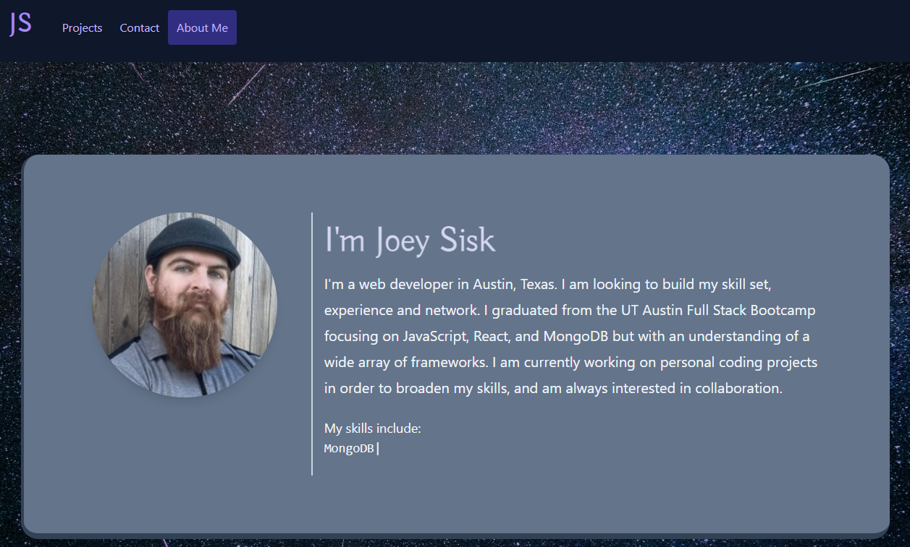

# Portfolio

## Description

This portfolio was created with react and incorporates a wide array of concepts and modules. The styling and asthetics are achieved with [TailwindCSS](https://tailwindcss.com/) and several npm custom scripts such as [Typical](https://www.npmjs.com/package/react-typical) and [react-social-icons](https://www.npmjs.com/package/react-social-icons). The hosting is done through Netlify and [craco](https://www.npmjs.com/package/@craco/craco) was used in order to allow TailwindCSS which doesnt nativly support the newest version of react. [React-router-dom](https://www.npmjs.com/package/react-router-dom) was essential for the functionality and navigation throughout the website. [Sanity.io](https://www.sanity.io/) was used as the content management system to allow for smooth updating of content on the portfolio. I used a [youtube tutorial](https://www.youtube.com/watch?v=NO7_jgzVgbc) by Traversy Media to setup the original layout and Sanity implementation. 

## Table of Contents

* [Link](#Link)

* [Screenshot](#Screenshot)

* [License](#license)

* [Contributing](#contributing)

* [Questions](#questions)

## Link

[This link will take you to the deployed site on Netlify!](https://joeysiskportfolio.netlify.app/)

## Screenshot

## License

- MIT

- https://opensource.org/licenses/MIT
  
## Contributing

This would not have been possible without the help of my tutor Kumar Ramanathan, my instructor Calvin Carter, all of the class TA's including Sean Belverstone, Daniel Vega, and Fernando Medina, Elizabeth H. and my many fellow UT Bootcamp students. Background images provided by Pexels, originally by Philippe Donn and Felix Mittermeier.

## Questions

If you have any questions about the app, open an issue or contact me through the contact form on my portfolio website: https://joeysiskportfolio.netlify.app/. You can find more of my work at [Joey Sisk](github.com/joey-sisk).
